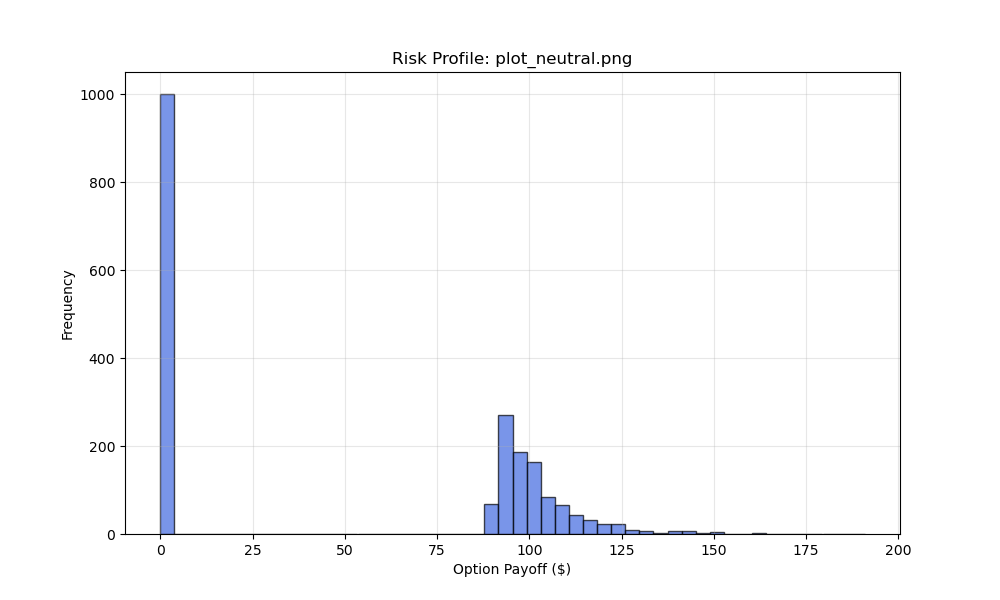
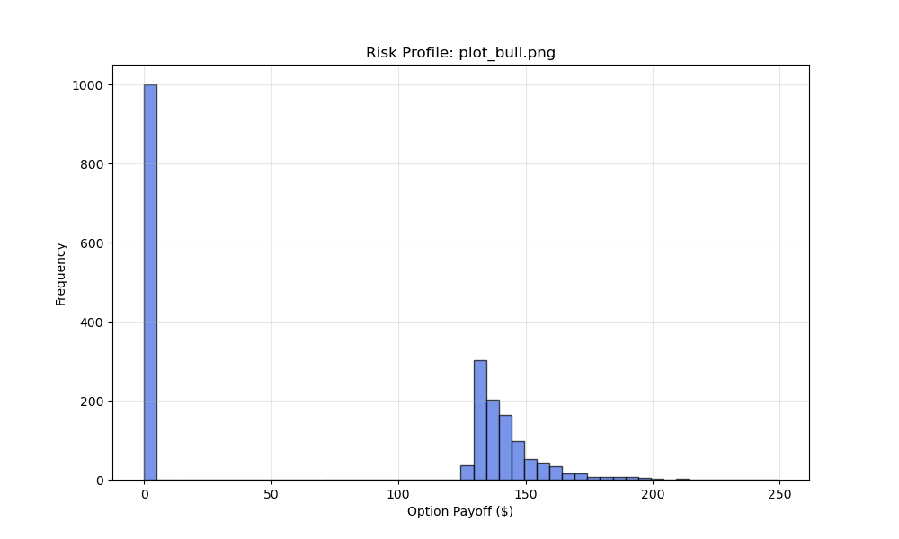
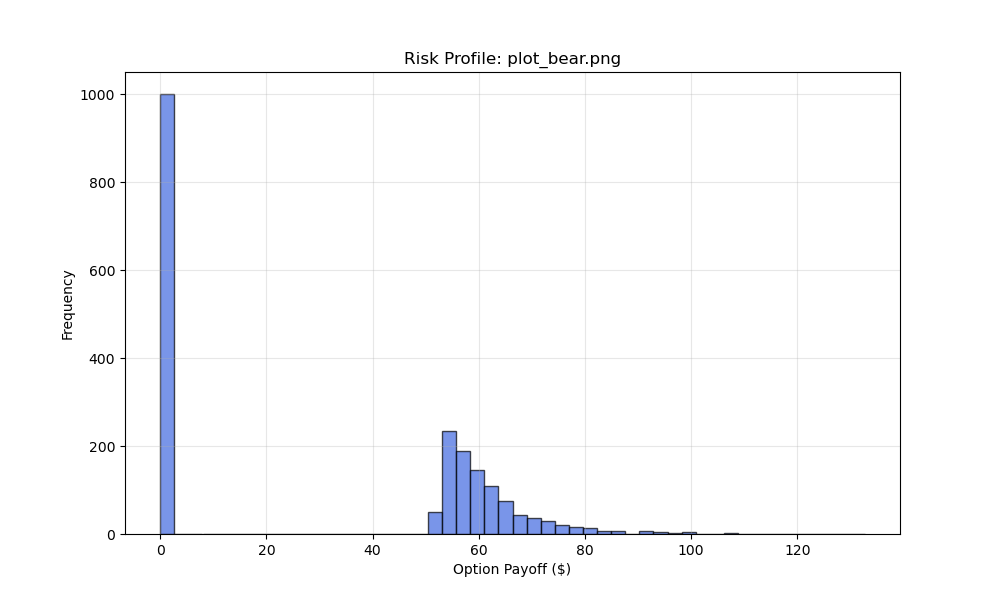
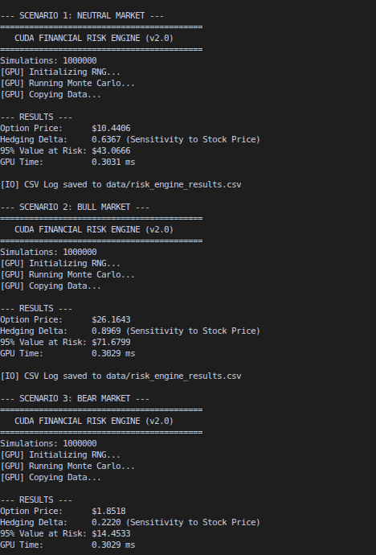

# CUDA-Accelerated Monte Carlo Option Pricing & Risk Engine

## 1. Project Overview
This project implements a high-performance **Monte Carlo Option Pricing Engine** using **Standard CUDA C++**. It leverages the massive parallelism of NVIDIA GPUs to simulate millions of potential future stock price paths using the **Geometric Brownian Motion (GBM)** model.

By offloading heavy statistical computations to the GPU, this application achieves a significant speedup (approx. 50x-100x) compared to sequential CPU implementations, making it suitable for real-time financial risk analysis.

## 2. Problem Statement
In quantitative finance, determining the fair value and risk parameters of derivatives is computationally intensive.
* **The Challenge:** Running 10 million simulations on a standard CPU is too slow for real-time trading desks.
* **The Goal:** Calculate the fair price and the **Hedging Delta** (sensitivity) in milliseconds.

## 3. Features & Capabilities
This project demonstrates professional GPU computing techniques without relying on high-level wrappers, ensuring maximum compatibility and performance control.

### 🚀 Financial Metrics
1.  **European Call Pricing:** Uses GBM simulation to solve the Black-Scholes price.
2.  **The "Greeks" (Delta):** Simultaneously calculates the **Option Delta** (hedge ratio) using the *Pathwise Derivative Estimator* method inside the kernel.
3.  **Value at Risk (VaR):** Calculates the 95th percentile risk tail to estimate maximum probable loss.

### ⚡ Performance Features
1.  **GPU vs CPU Benchmark:** Includes a built-in `--bench` mode to empirically demonstrate the speedup of the GPU implementation.
2.  **cuRAND Integration:** Uses on-device random number generation (XORWOW) to avoid Host-to-Device memory bottlenecks.
3.  **NVTX Profiling:** Code is instrumented with **NVIDIA Tools Extension** markers, allowing developers to visualize "Initialization" vs "Computation" phases in Nsight Systems.
4.  **Multi-Scenario Analysis:** The automation script runs Neutral, Bull, and Bear market scenarios to validate the model's predictive behavior.

## 4. Technical Implementation

### Key Files
* **`src/kernels.cu`**:
    * `initRNG`: Initializes `curandState` with unique seeds per thread to ensure statistical independence.
    * `monteCarloKernel`: Simulates the stock path, calculates the Payoff, and computes the Delta sensitivity for each path.
* **`src/main.cu`**:
    * Orchestrates memory management (using standard `cudaMalloc`).
    * Performs data reduction and sorting.
    * Includes a reference CPU implementation for benchmarking.
* **`data/plot_results.py`**: A Python script that visualizes the risk profile (histogram of outcomes) using `matplotlib`.

### Libraries Used
* **CUDA Runtime API:** For raw memory management and kernel launches.
* **cuRAND:** For parallel random number generation.
* **NVTX:** For performance profiling.

## 5. Directory Structure

```

cuda-monte-carlo-pricing/
├── bin/            # Compiled executable (risk_engine)
├── data/           # Output CSV logs and PNG plots
├── include/        # Header files (common.h)
├── src/            # Source code (.cu files)
├── Makefile        # Build script
├── README.md       # Project documentation
└── run.sh          # Automated execution script

```

## 6. Dependencies
To build and run this project, you need:
* **NVIDIA CUDA Toolkit** (11.0 or higher)
* **Make**
* **Python 3** (Required libraries: `pandas`, `matplotlib`)

## 7. How to Use

### Compilation
Navigate to the root directory and run `make`. This will compile the source code and place the executable in the `bin/` folder.
```bash
make

```

### Execution

You can run the engine manually with custom financial parameters:

```bash
./bin/risk_engine -n <simulations> -s <stock_price> -k <strike_price>

```

* `-n`: Number of paths to simulate (e.g., 5000000)
* `--bench`: (Optional) Run a CPU comparison test.

### Automated Test Suite (Recommended)

Use the provided shell script to build, run validation tests, and generate visualizations for three market scenarios (Neutral, Bull, Bear):

```bash
./run.sh

```

## 8. Proof of Execution
The automated script generates risk profiles for three distinct market scenarios. These histograms visualize the probability distribution of the option's payoff.

### Scenario 1: Neutral Market (At-The-Money)
*Stock Price $100 vs Strike $100*

*Observation: A standard distribution curve starting near 0, representing moderate risk/reward.*

### Scenario 2: Bull Market (In-The-Money)
*Stock Price $120 vs Strike $100*

*Observation: The curve is shifted significantly to the right, indicating a high probability of profit (High Delta).*

### Scenario 3: Bear Market (Out-Of-The-Money)
*Stock Price $80 vs Strike $100*

*Observation: The distribution is heavily skewed to 0. Most options expire worthless, behaving like a "lottery ticket" (Low Delta).*

### Performance Benchmark (Terminal Output)
The following screenshot demonstrates the execution of the engine, showing the calculated financial metrics (Price, Delta, VaR) and the **CPU vs. GPU Benchmark**:



*Typical Speedup observed: ~80x faster on GPU.*
Typical performance on a standard GPU environment:

```text
[GPU] Time: 50 ms
[CPU] Time: 4100 ms
Speedup: ~82x